# Octo Tree

Radial visualization tool for exploring git-tracked files in any repository. The CLI spins up a local web server that exposes the repository tree (gitignore-aware) and serves a D3-powered radial file tree in the browser.

| | | |
|---|---|---|
|  | 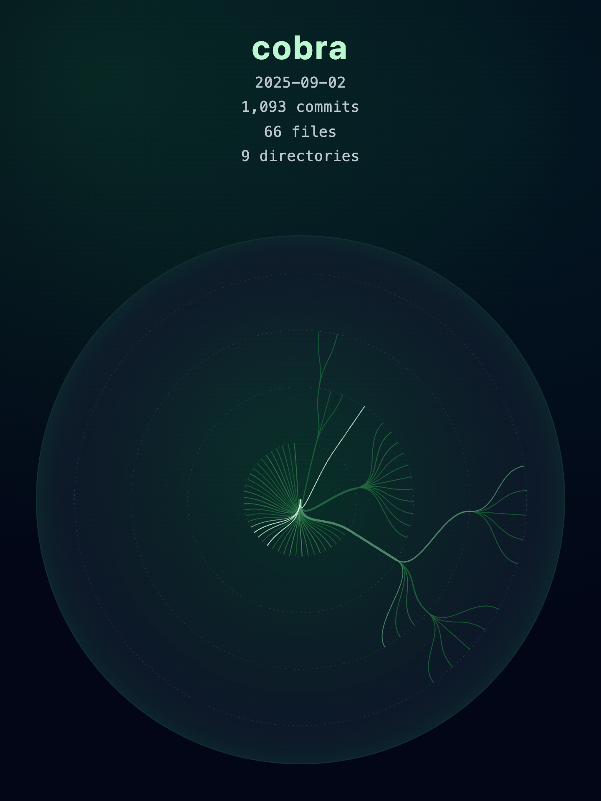 | 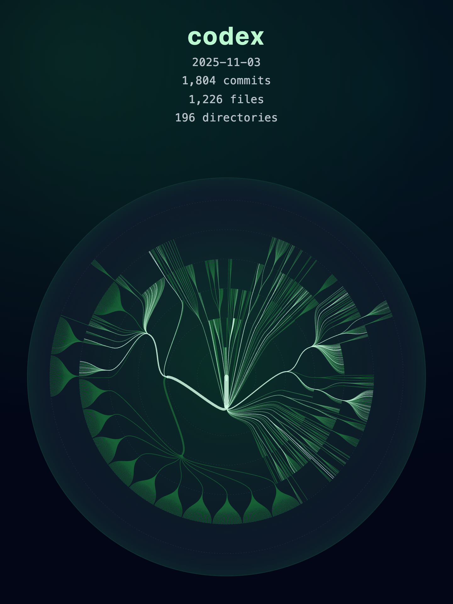 |
| 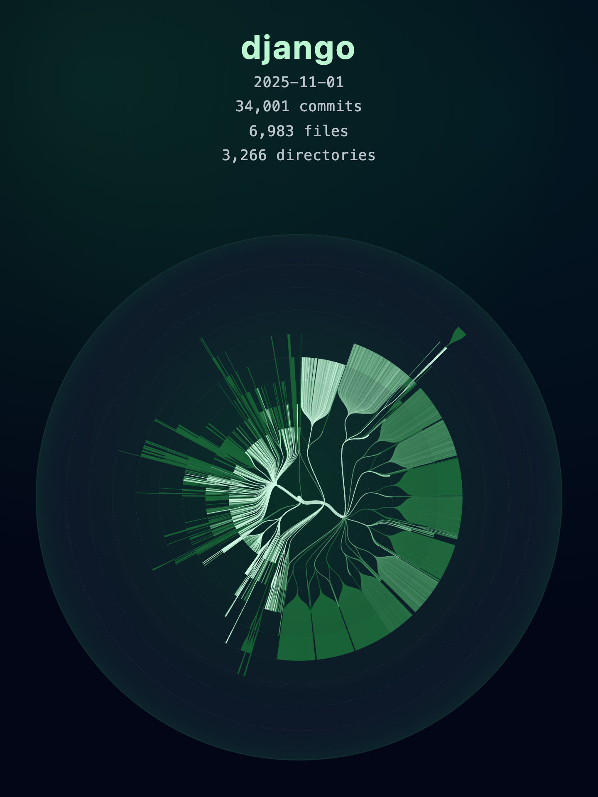 | 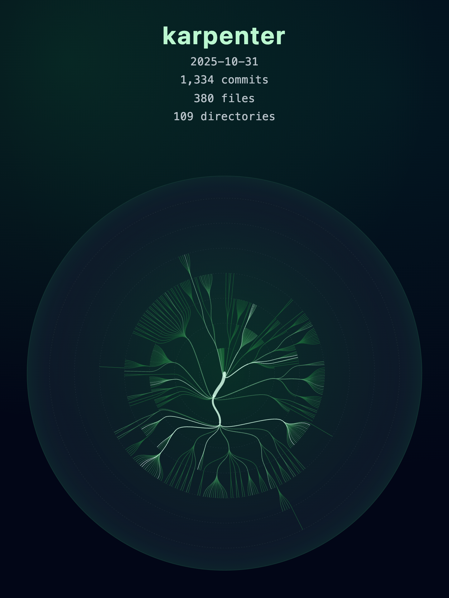 | 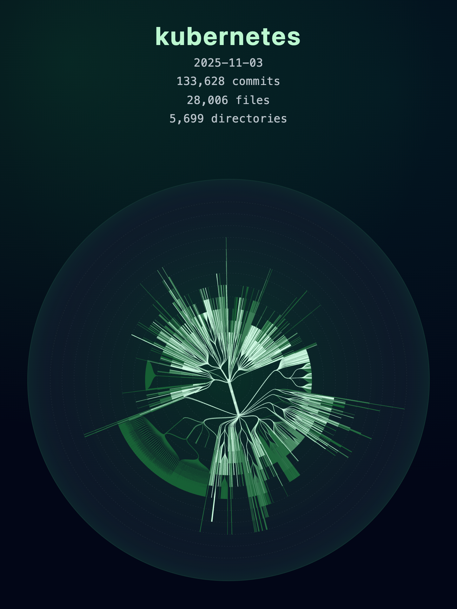 |
| 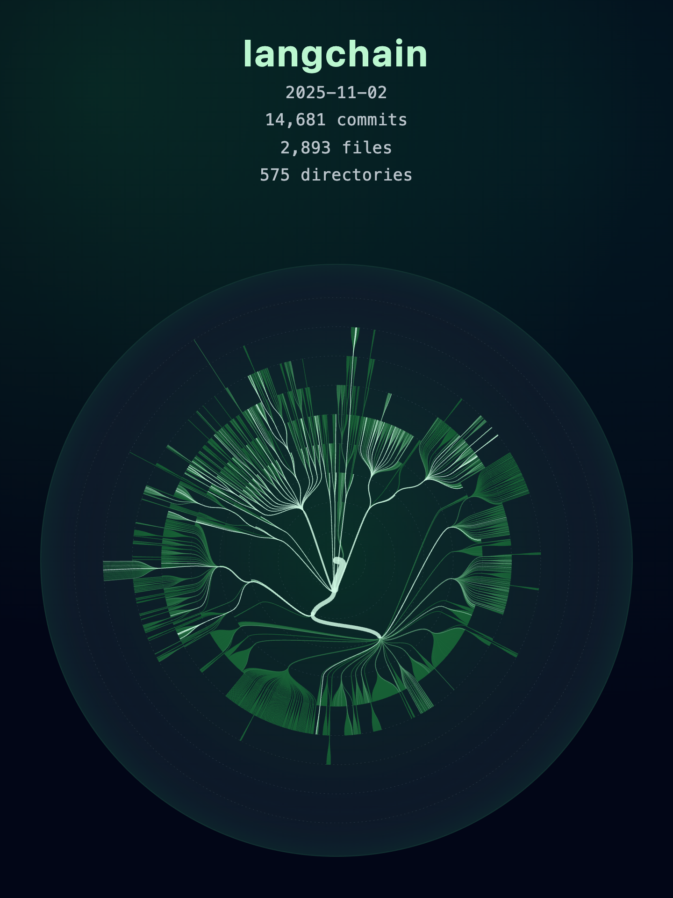 | 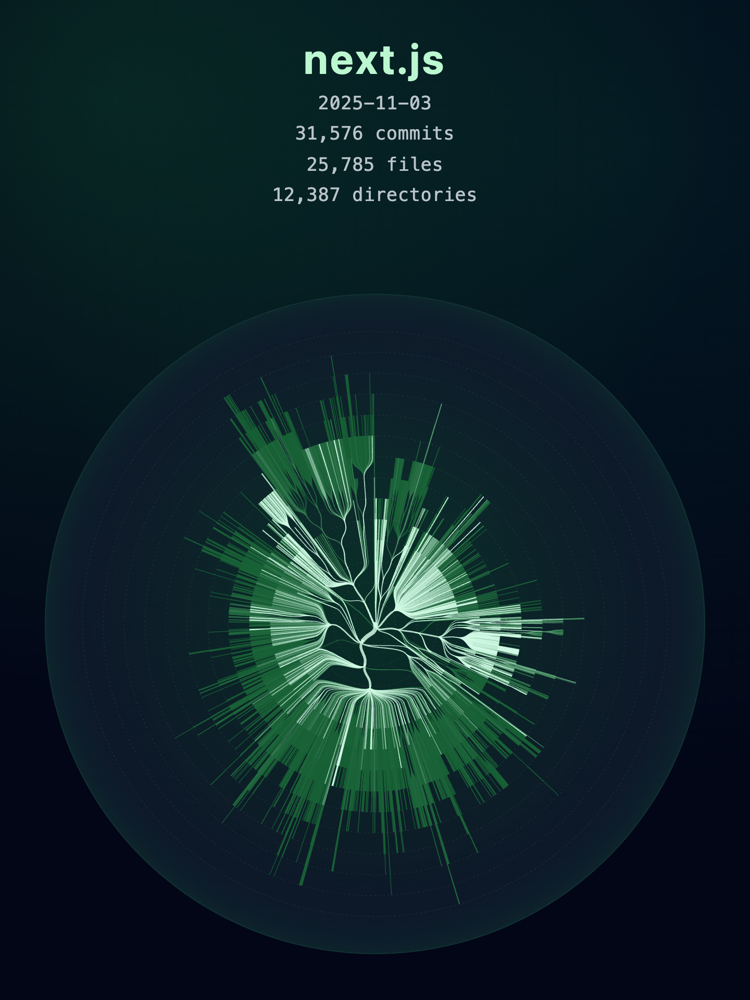 | 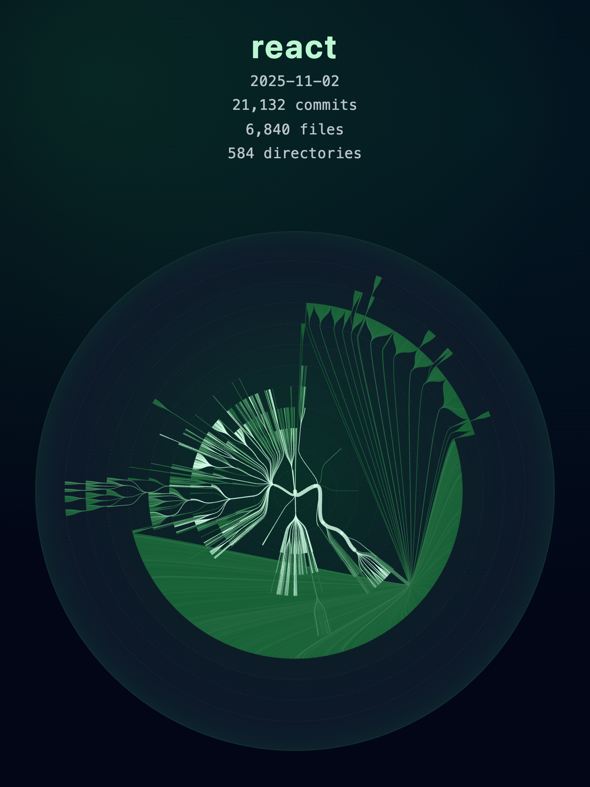 |
| 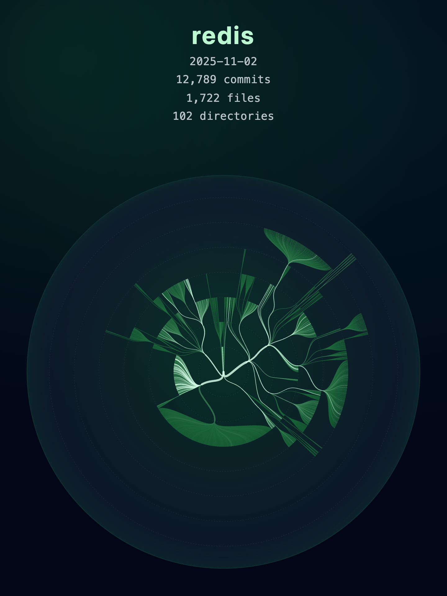 | 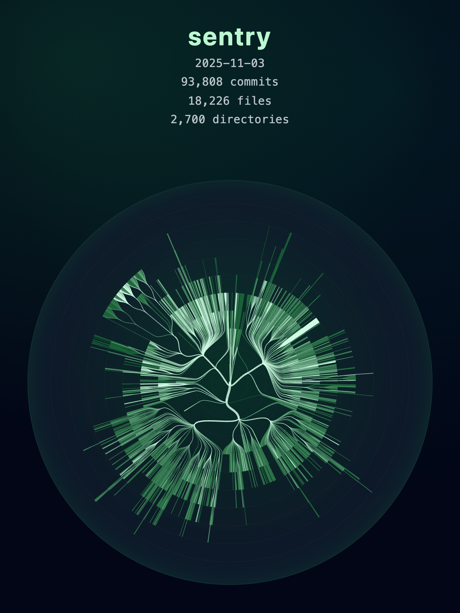 | 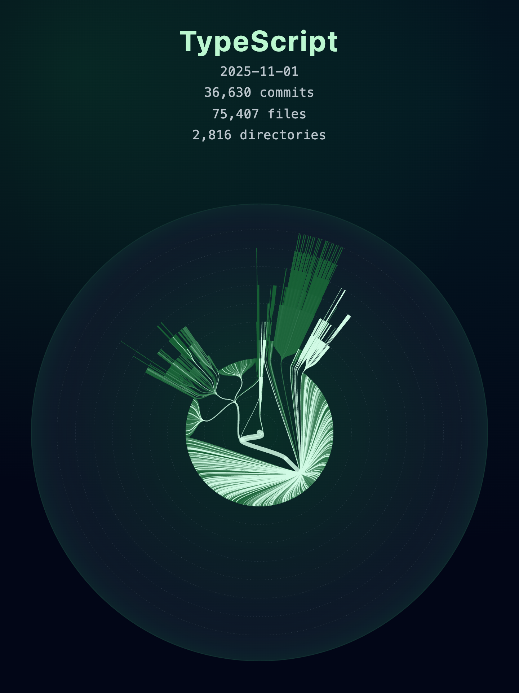 |

## Workspace Layout

This is a monorepo containing multiple packages:

- [`packages/core`](./packages/core/README.md) — Git-aware tree builder and shared types.
- [`packages/server`](./packages/server/README.md) — Express server exposing `/api/tree` and hosting the built web assets.
- [`packages/cli`](./packages/cli/README.md) — Command-line entry point that launches the server for a target repo.
- [`packages/web`](./packages/web/README.md) — React + Vite front-end (radial D3 visualization with hover interactions).
- [`e2e`](./e2e/README.md) — End-to-end tests that verify cross-package integration and workflows.

See individual package READMEs for detailed documentation.

## Prerequisites
- Node.js 18+
- Git available on `PATH` (the tree builder shells out to `git`).

## Install Dependencies
```bash
npm install
```

## Run Tests
```bash
npm test
```

This runs all unit tests from the packages and the end-to-end (e2e) tests.

### Running Tests Separately
```bash
# Run only unit tests from packages
npm run test --workspaces --if-present

# Run only e2e tests
npm run test:e2e
```

**Note:** The e2e tests require the web package to be built. Run `npm run build:web` before running e2e tests if you haven't already.

See [`e2e/README.md`](./e2e/README.md) for detailed test documentation.

## Build All Packages
```bash
npm run build         # builds TypeScript packages and the front-end bundle
# or run them individually
npm run build:backend # project-reference TypeScript build (core/server/cli)
npm run build:web     # Vite production build for the visualization
```

## Launch the CLI
```bash
node packages/cli/dist/index.js --repo /path/to/git/repo --port 3000
# or explicitly invoke the serve subcommand
node packages/cli/dist/index.js serve --repo /path/to/git/repo --ref HEAD
```

Options:
- `--repo` defaults to the current working directory.
- `--port` defaults to `3000`.
- `--ref` defaults to `HEAD` (any valid git ref/commit SHA).
- `--level` fixes the number of concentric levels in the visualization; branches deeper than this stop at the outer ring.

When the CLI reports the server URL, open it in your browser to explore the radial tree. The visualization fetches `/api/tree` (gitignore-aware), displays hover tooltips for branch metadata, and you can trigger a rebuild any time with `POST /api/tree/refresh`.

## Capture a Screenshot
```bash
node packages/cli/dist/index.js screenshot --repo /path/to/git/repo --output octo-tree.png
```

Options:
- `--repo` defaults to the current working directory.
- `--output` defaults to `octo-tree.png` (auto-appends `.png` if missing).
- `--port` defaults to `0`, so an open port is allocated automatically.
- `--width` defaults to `1440` CSS pixels (3/4 of the serve viewport width).
- `--aspect` defaults to `4:3` (format `x:y`).
- `--ref` defaults to `HEAD` (any valid git ref/commit SHA).
- `--level` fixes the number of concentric levels in the SVG output; deeper branches terminate at the outer ring.

The PNG is rendered at the requested CSS width/height with a device scale factor of `2`, so the output bitmap is twice as dense as the viewport dimensions.

## Generate a Video
```bash
node packages/cli/dist/index.js video --repo /path/to/git/repo --output octo-tree.mp4
```

Options:
- `--repo` defaults to the current working directory.
- `--output` defaults to `octo-tree.mp4` (auto-appends `.mp4` if missing).
- `--port` defaults to `0`, so an open port is allocated automatically for each frame.
- `--width` defaults to `1440` CSS pixels; `--aspect` defaults to `4:3`.
- `--fps` defaults to `10` frames per second.
- `--max-seconds` defaults to `60`; frames are uniformly sampled to keep within `fps × max-seconds`.
- `--from` / `--to` bound the commits considered (1-indexed, inclusive). If omitted they default to the first and last commit respectively, while the UI still shows cumulative commit counts.
- `--level` fixes the number of concentric levels in every captured frame; deeper branches terminate at the outer ring.

The command captures PNG frames for each sampled commit (oldest → newest) and stitches them into an MP4 using the bundled ffmpeg binary.

Large repositories are supported—the tree builder streams `git ls-files` output to avoid buffer limits.

Branch thickness reflects how many files live inside a directory, branch color lightens with the largest descendant file size (capped at the 90th percentile), and the sidebar highlights directories/files alongside latest commit time and commit count.

## Performance Profiling

Profile performance using Chrome DevTools (built into Node.js):

```bash
# Profile video generation
npm run profile:video

# Profile screenshot generation
npm run profile:screenshot
```

Then:
1. Open Chrome and go to `chrome://inspect`
2. Click "inspect" under your Node.js process
3. Go to "Performance" tab and click record
4. Analyze the flame chart to identify bottlenecks

See [PROFILING.md](./PROFILING.md) for detailed instructions.

## Development Scripts
- `npm run dev --workspace @octotree/cli` — Run the CLI via `ts-node-dev` without rebuilding.
- `npm run dev --workspace @octotree/server` — Start the server entry directly (use a built web bundle or run Vite in parallel).
- `npm run dev --workspace @octotree/web` — Start the Vite dev server for the front-end; proxy API requests to the Express server when iterating on the UI.

## Next Steps
- Add filesystem watching to invalidate the cached tree automatically.
- Integrate search/filter controls for large repositories.
- Expose additional metadata overlays (e.g. file sizes, git history) in the visualization.
